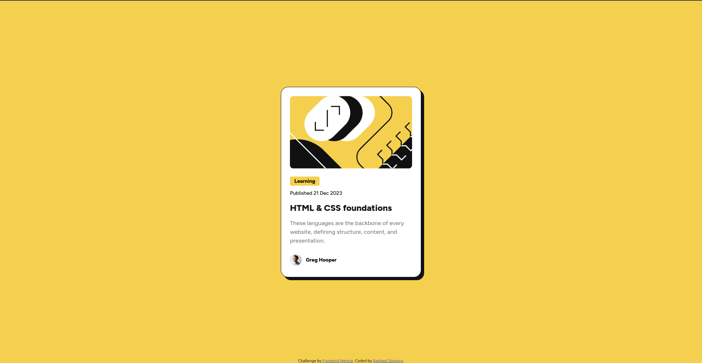

# Frontend Mentor - Solução do Cartão de Visualização de Blog

Esta é uma solução para o [desafio do Cartão de Visualização de Blog no Frontend Mentor](https://www.frontendmentor.io/challenges/blog-preview-card-ckPaj01IcS). Os desafios do Frontend Mentor ajudam você a melhorar suas habilidades de codificação construindo projetos realistas.

## Sumário

- [Visão Geral](#visão-geral)
  - [O Desafio](#o-desafio)
  - [Captura de Tela](#captura-de-tela)
  - [Links](#links)
- [Meu Processo](#meu-processo)
  - [Construído com](#construído-com)
  - [O que Aprendi](#o-que-aprendi)
  - [Desenvolvimento Futuro](#desenvolvimento-futuro)
  - [Recursos Úteis](#recursos-úteis)
- [Autor](#autor)
- [Agradecimentos](#agradecimentos)

## Visão Geral

### O Desafio

Os usuários devem ser capazes de:

- Ver estados de hover e foco para todos os elementos interativos na página.

### Captura de Tela

### Links

- URL da Solução: [GitHub](https://github.com/raphaelsiqueiira/blog-preview-card-main)
- URL do Site Ao Vivo: [GitHub Pages](https://raphaelsiqueiira.github.io/blog-preview-card-main/)

## Meu Processo

### Construído com

- Marcação HTML5 semântica
- Propriedades personalizadas de CSS
- Flexbox
- CSS Grid

### O que Aprendi

Enquanto trabalhava neste projeto, reforcei meu conhecimento em técnicas de layout CSS, incluindo flexbox e grid. Além disso, melhorei minha compreensão dos princípios de design responsivo e dos estados de hover e foco em CSS.

### Desenvolvimento Futuro

Em projetos futuros, pretendo refinar ainda mais minhas habilidades em CSS e continuar aprendendo JavaScript para adicionar interatividade e funcionalidade aos meus projetos.

### Recursos Úteis

- [MDN Web Docs](https://developer.mozilla.org/) - Documentação abrangente de desenvolvimento web.
- [CSS-Tricks](https://css-tricks.com/) - Artigos e guias úteis sobre CSS.

## Autor

- GitHub - [raphaelsiqueiira](https://github.com/raphaelsiqueiira)
- Frontend Mentor - [@raphaelsiqueiira](https://www.frontendmentor.io/profile/raphaelsiqueiira)
- X (Twitter) - [@Raphael_4z](https://x.com/Raphael_4z)

## Agradecimentos

Gostaria de agradecer ao Frontend Mentor por fornecer este desafio e à comunidade pelo suporte e feedback.
